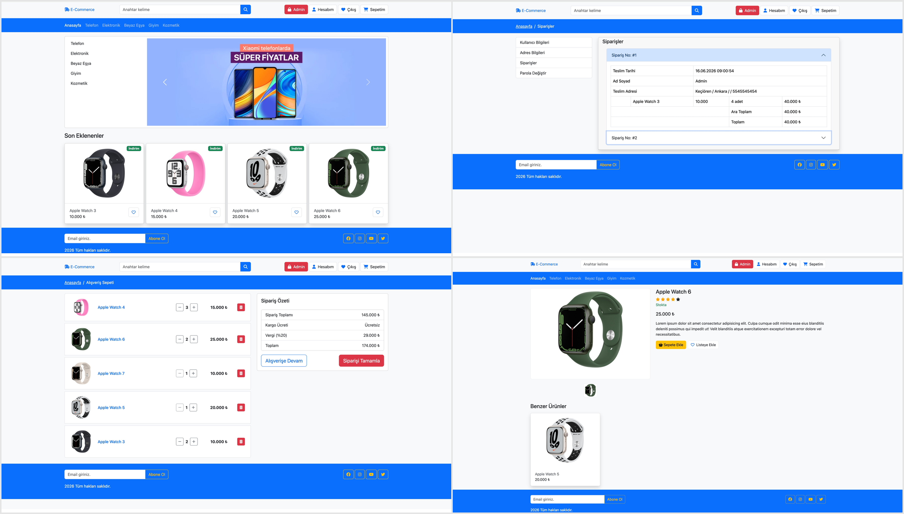
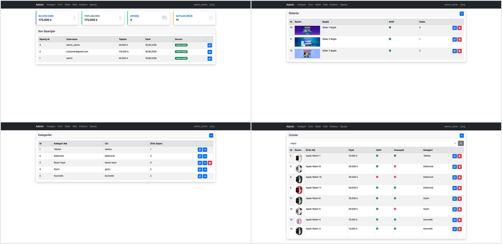

shopApp

ASP.NET Core MVC + Web API ile geliştirdiğim bir e-ticaret uygulaması. Proje, önceki MVC tabanlı versiyonumun yeniden yapılandırılmış ve daha modern bir mimariye (frontend MVC, backend Web API) taşınmış halidir.

Ürün listeleme, sepet, ödeme ve admin paneli gibi temel e-ticaret akışları uçtan uca çalışacak şekilde tasarlanmıştır.

Aslında bu projeye MVC, Entity Framework ve Identity konularını daha iyi anlamak için başlamıştım. Sonrasında frontend ve backend ayrımı yaparak Web API ile birlikte daha gerçekçi bir mimariye dönüştürdüm. Bu süreç, hem authentication yapısını hem de sistem tasarımını daha iyi kavramamı sağladı.

Neler Var

Kullanıcı işlemleri ASP.NET Core Identity ile yönetiliyor; üyelik, giriş ve şifre sıfırlama (e-posta ile) süreçleri aktif şekilde çalışıyor.

Ürünler kategoriye göre listelenebiliyor, arama yapılabiliyor ve detay sayfası görüntülenebiliyor.

Sepet tarafında kullanıcı giriş yapmadan ürün ekleyemiyor; sepete ekleme için önce login olunması gerekiyor.

Ödeme tarafında Iyzico (sandbox) entegrasyonu kullanıldı ve siparişler başarılı ödeme sonrası veritabanına kaydediliyor. Kullanıcı kendi sipariş geçmişini görüntüleyebiliyor. Aynı zamanda Admin panelinden bütün siparişler görüntülenebiliyor.

## 🖼️ Ekran Görüntüleri

### Ana Sayfa

### Admin Paneli

Admin panelinde şu işlemler yapılabiliyor:

Ürün ekleme, silme, güncelleme (görsel yükleme desteğiyle)
Kategori yönetimi
Slider yönetimi
Kullanıcı yönetimi
Rol ekleme ve kullanıcıya rol atama
Siparişleri görüntüleme ve detay inceleme

Authentication (Önemli Detay)

Bu projede authentication JWT tabanlı olarak kurgulandı. Login sonrası bir JWT token oluşturuluyor ve bu token kullanıcı bilgilerini, username'i ve rol bilgilerini içeriyor.

Token, localStorage'da değil cookie içinde saklanıyor. Bunun sebebi XSS saldırılarına karşı daha güvenli bir yaklaşım tercih edilmesi.

Teknolojiler

Backend: ASP.NET Core Web API
Frontend: ASP.NET Core MVC
Kimlik Doğrulama: ASP.NET Core Identity + JWT
Veritabanı: SQLite, Entity Framework Core
Ödeme: Iyzico (sandbox) — test kartlarıyla ödeme simülasyonu yapılabiliyor

Çalıştırmak İçin

.NET 9 SDK kurulu olmalı. Bir de migration'ları çalıştırmak için EF Core aracı:

dotnet tool install --global dotnet-ef

Sonra:

git clone https://github.com/M-Fatih00/shopApp.git
cd shopApp

E-posta ve ödeme bilgilerini koda gömmedim, user-secrets'ta tutuyorum. Kendi değerlerini girmen gerekiyor (komutları AspNetAPI klasörü içinde çalıştır):

dotnet user-secrets init
dotnet user-secrets set "Email:Username" "ornek@gmail.com"
dotnet user-secrets set "Email:Password" "gmail-uygulama-sifresi"
dotnet user-secrets set "PaymentAPI:APIKey" "sandbox-api-key"
dotnet user-secrets set "PaymentAPI:SecretKey" "sandbox-secret-key"

Iyzipay sandbox anahtarlarını sandbox-merchant.iyzipay.com adresinden ücretsiz alabilirsin.

Veritabanını oluştur ve API'yi çalıştır:

dotnet ef database update
dotnet run

API çalışır durumdayken, ayrı bir terminalde AspNetUI klasörüne geçip MVC projesini de başlat:

cd ../AspNetUI
dotnet run

Demo Hesaplar

Uygulama ilk açıldığında bu hesaplar otomatik oluşuyor:

Admin: admin@gmail.com / 123456 / admin
Müşteri: customer@gmail.com / 123456 / customer

Ödeme Testi

Sandbox olduğu için gerçek kart gerekmez. Test kartı:

Kart no: 5528 7900 0000 0008
Son kullanma: 12/30
CVV: 123

!! Not:

Bu proje benim için MVC'den Web API mimarisine geçiş sürecini temsil ediyor. İlk projemde sadece MVC ile çalışırken, burada backend ve frontend'i ayırarak gerçek bir API mimarisinin nasıl kurulduğunu, authentication'ın nasıl yönetildiğini ve bu iki yapının birbirine nasıl bağlandığını uygulamalı olarak öğrendim.

Şu an bir sonraki hedefim olarak frontend'de React + Redux Toolkit, backend'de ise Web API kullanarak çok daha kapsamlı ve detaylı bir e-ticaret projesi geliştiriyorum. Bu projede gerçek hayattaki bir e-ticaret sitesine birebir uyumlu olmasına ve tam responsive bir tasarıma sahip olmasına özellikle önem veriyorum.